# Claude Code Delegation System

A hook-based framework for Claude Code that enforces task delegation to specialized agents, enabling structured workflows and expert-level task handling.

## Overview

This system uses Claude Code's hook mechanism to:
1. **Block direct tool usage** via PreToolUse hooks
2. **Force delegation** to specialized agents via the `/delegate` command
3. **Enable multi-step workflows** via system prompt orchestration

## Core Components

### 1. Delegation Hook (`hooks/PreToolUse/require_delegation.sh`)

Blocks most tools and forces delegation to specialized agents.

**Allowed tools:**
- `AskUserQuestion` - Ask users for clarification
- `TodoWrite` - Track task progress
- `SlashCommand` - Execute slash commands (including `/delegate`)
- `Task` - Spawn subagents

**All other tools are blocked** and show:
```
🚫 Tool blocked by delegation policy
✅ REQUIRED: Use /delegate command immediately
```

### 2. Specialized Agents (`agents/`)

10 specialized agents for different task types:

- **delegation-orchestrator** - Analyzes tasks and routes to appropriate agents
- **tech-lead-architect** - Solution design, architecture, research
- **codebase-context-analyzer** - Code exploration, architecture analysis
- **task-decomposer** - Project planning, task breakdown
- **task-completion-verifier** - Validation, testing, quality assurance
- **code-cleanup-optimizer** - Refactoring, technical debt reduction
- **code-reviewer** - Code review for best practices
- **devops-experience-architect** - Infrastructure, deployment, CI/CD
- **documentation-expert** - Documentation creation and maintenance
- **dependency-manager** - Dependency management and updates

### 3. Delegation Command (`commands/delegate.md`)

The `/delegate` command provides intelligent task delegation:

```bash
/delegate <task description>
```

**How it works:**
1. Spawns the `delegation-orchestrator` agent
2. Orchestrator analyzes task complexity (single-step vs multi-step)
3. Selects appropriate specialized agent(s)
4. Constructs optimized delegation prompt
5. Returns recommendation for execution

### 4. Workflow Orchestration System Prompt (`system-prompts/WORKFLOW_ORCHESTRATOR.md`)

Enables multi-step workflow orchestration for complex tasks.

**Activate via:**
```bash
claude --append-system-prompt "$(cat ./system-prompts/WORKFLOW_ORCHESTRATOR.md)"
```

**Multi-step detection patterns:**
- Sequential connectors: "and then", "after that", "next"
- Compound indicators: "with [noun]", "including [noun]"
- Multiple verbs: "create X and test Y"

**Workflow execution:**
1. Detects multi-step patterns
2. Creates TodoWrite task list
3. Delegates each step sequentially
4. Passes context between steps
5. Provides final summary with absolute paths

## Setup

### 1. Install Configuration

Copy the repository contents to your project's `.claude/` directory or use it as your global Claude Code configuration:

```bash
cp -r agents commands hooks system-prompts settings.json ~/.claude/
```

### 2. Configure Hooks

The `settings.json` already configures the required hooks:

```json
{
  "hooks": {
    "PreToolUse": [
      {
        "matcher": "*",
        "hooks": [{"type": "command", "command": "~/.claude/hooks/PreToolUse/require_delegation.sh"}]
      }
    ],
    "UserPromptSubmit": [
      {
        "hooks": [{"type": "command", "command": "~/.claude/hooks/UserPromptSubmit/clear-delegation-sessions.sh"}]
      }
    ]
  }
}
```

### 3. Enable Workflow Orchestration (Optional)

For multi-step workflows, append the orchestration system prompt:

```bash
claude --append-system-prompt "$(cat ~/.claude/system-prompts/WORKFLOW_ORCHESTRATOR.md)"
```

Or add to your shell alias:

```bash
alias claudew='claude --append-system-prompt "$(cat ~/.claude/system-prompts/WORKFLOW_ORCHESTRATOR.md)"'
```

## Usage

This section provides comprehensive guidance on how to use the delegation system effectively. You'll learn how the system processes your requests from initial submission through specialized agent execution, understand the visual flowcharts that illustrate the system's architecture, and see practical examples of delegation patterns for both simple and complex workflows.

The delegation system orchestrates a sophisticated workflow from user request through specialized agent execution. Here's the complete flow:

### Complete Delegation Flow

1. **User prompts normally** - Submit any task request to Claude Code
2. **WORKFLOW_ORCHESTRATOR detects patterns** - System prompt analyzes for multi-step indicators
3. **TodoWrite creates task list** - Phases are tracked and organized
4. **Tool attempts blocked by PreToolUse hook** - Direct tool usage is intercepted
5. **CLAUDE.md policy enforces immediate delegation** - Instructions require `/delegate` usage
6. **Hook registers session** - First `/delegate` usage marks session as delegated
7. **Orchestrator analyzes and recommends** - Task complexity determines single vs multi-step approach
8. **Main Claude executes phases** - Tools are allowed but delegation pattern continues
9. **Context passes between phases** - Results flow forward through workflow

### High-Level Mechanism Flowchart

This flowchart illustrates the complete decision tree and execution flow of the delegation system, showing how user requests are analyzed, routed, and executed through specialized agents.

**How to read this chart:**
- **Start point**: User submits a request to Claude Code
- **Decision diamonds**: Key decision points (command type detection, multi-step analysis, phase continuation)
- **Process rectangles**: Actions taken by the system (orchestration, analysis, prompt building)
- **Flow paths**: The path taken depends on whether the task is a delegation command or regular execution, and whether it's single-step or multi-step

**Key insights:**
- The system differentiates between `/delegate` commands and regular requests at the entry point
- Task complexity analysis determines whether to use single-step or multi-step workflow
- Multi-step workflows involve decomposition into phases, agent mapping, and context template creation
- Single-step workflows directly select an agent and build a delegation prompt
- User reviews recommendations before execution, maintaining control over the workflow
- The Task tool spawns specialized agents in isolated sessions
- Context passes forward through phases in multi-step workflows until completion


### Detailed Sequence: "Build calculator with tests" Example

This sequence diagram provides a concrete walkthrough of how the delegation system handles a real-world multi-step task: creating a calculator application with accompanying tests.

**How to read this chart:**
- **Participants**: The different components involved in the workflow (User, Claude Main, Orchestrator, Config, Task Tool, Specialized Agent)
- **Arrows**: Messages and actions flowing between components, showing the chronological sequence
- **Note boxes**: Important internal processing steps happening within a component
- **Vertical timeline**: Time flows from top to bottom, showing the order of operations

**Key insights:**
- The delegation orchestrator detects "with tests" as a multi-step indicator and automatically decomposes the task into two phases
- Agent selection happens during orchestration: general-purpose for code creation, task-completion-verifier for testing
- Context passing is explicit: the file path from Phase 1 is passed to Phase 2, enabling the test agent to locate and test the calculator
- Configuration loading happens just-in-time: agent system prompts are loaded only when needed for execution
- User maintains control at each phase: execution requires explicit user confirmation between phases
- The specialized agent for Phase 2 reads the created code, writes tests, and verifies coverage before completion
- Absolute file paths ensure unambiguous references across phases

```mermaid
sequenceDiagram
    participant User
    participant Claude as Claude Main
    participant Orch as Delegation Orchestrator
    participant Config as Agent Config
    participant Task as Task Tool
    participant Agent as Specialized Agent

    User->>Claude: /delegate Create calculator with tests
    Claude->>Orch: Invoke orchestrator

    Note over Orch: Task Complexity Analysis
    Orch->>Orch: Detect multi-step indicators
    Orch->>Orch: "with tests" detected

    Note over Orch: Task Decomposition
    Orch->>Orch: Phase 1: Create calculator
    Orch->>Orch: Phase 2: Write tests

    Note over Orch: Agent Selection
    Orch->>Orch: Phase 1 → general-purpose
    Orch->>Orch: Phase 2 → task-completion-verifier

    Orch->>Config: Load task-completion-verifier.md
    Config-->>Orch: Agent system prompt

    Note over Orch: Prompt Construction
    Orch->>Orch: Build Phase 1 prompt
    Orch->>Orch: Build Phase 2 template with context placeholders

    Orch-->>Claude: Multi-step recommendation

    Note over Claude: Phase 1 Ready
    Claude->>User: Show Phase 1 recommendation
    User->>Claude: Execute Phase 1

    Claude->>Task: Delegate with Phase 1 prompt
    Task->>Agent: Execute (general-purpose)
    Agent-->>Task: Calculator created at /path/to/calc.py
    Task-->>Claude: Phase 1 results

    Note over Claude: Context Passing
    Claude->>Claude: Extract: file path, functionality

    Note over Claude: Phase 2 Preparation
    Claude->>User: Show Phase 2 recommendation with context
    User->>Claude: Execute Phase 2

    Claude->>Task: Delegate with Phase 2 prompt + context
    Task->>Config: Load task-completion-verifier
    Config-->>Task: Verifier system prompt
    Task->>Agent: Execute (task-completion-verifier)

    Note over Agent: Test Creation
    Agent->>Agent: Read /path/to/calc.py
    Agent->>Agent: Write tests for calculator
    Agent->>Agent: Verify test coverage
    Agent-->>Task: Tests created and verified

    Task-->>Claude: Phase 2 complete
    Claude-->>User: All phases complete
```



### Basic Delegation

When any tool is blocked, immediately delegate:

```bash
/delegate Create a calculator module with add, subtract, multiply, divide functions
```

### Multi-Step Workflows

With orchestration system prompt enabled:

```bash
# Single command triggers full workflow
/delegate Create calculator.py with comprehensive tests and run them
```

The system will:
1. Create task list via TodoWrite
2. Delegate Phase 1: Create calculator.py
3. Delegate Phase 2: Write tests (with context from Phase 1)
4. Delegate Phase 3: Run tests (with context from Phase 2)
5. Provide consolidated summary

### Ask Without Modification

Use `/ask` when you only need information:

```bash
/ask How does the authentication system work?
```

## How It Works

### The Sophisticated Hook Mechanism

The system uses **stateful session tracking** to enforce delegation:

#### On Every User Prompt (UserPromptSubmit Hook)
1. **Clears delegation state** - Deletes `.claude/state/delegated_sessions.txt`
2. **Fresh slate** - No tools are pre-allowed, forcing explicit delegation

#### On Every Tool Call (PreToolUse Hook)
1. **Checks session registry** - Is this session ID in `delegated_sessions.txt`?
2. **If YES** - Allow tool (session was previously delegated)
3. **If NO** - Check if tool is in allowlist:
   - `TodoWrite`, `AskUserQuestion` - Always allowed
   - `SlashCommand`, `Task` - Allowed AND **registers session as delegated**
   - Everything else - **BLOCKED**

#### The Session Registration Key Insight

When `/delegate` is invoked:
1. SlashCommand tool is called
2. **Hook registers the calling session ID** in `delegated_sessions.txt`
3. **Main session is now "delegated"** - can use tools freely
4. But WORKFLOW_ORCHESTRATOR prompt instructs continued delegation per phase

### Example: "Build calculator app and then write tests for it and verify"

**Step-by-step execution:**

```
1. UserPromptSubmit Hook
   └─ Clears delegated_sessions.txt (fresh state)

2. User Message: "build calculator app and then write tests..."
   └─ Main Claude receives prompt
   └─ WORKFLOW_ORCHESTRATOR detects "and then" (multi-step)
   └─ Uses TodoWrite (ALLOWED) to create 3-phase task list

3. Main Claude tries Write tool
   └─ PreToolUse hook fires
   └─ Session NOT in delegated_sessions.txt
   └─ Write NOT in allowlist
   └─ ❌ BLOCKED: "Use /delegate immediately"

4. Main Claude follows CLAUDE.md policy
   └─ Invokes: /delegate build calculator app...
   └─ SlashCommand is ALLOWED
   └─ ✅ Hook REGISTERS main session in delegated_sessions.txt
   └─ Main session now "delegated"

5. /delegate command executes
   └─ Spawns delegation-orchestrator via Task (ALLOWED)
   └─ Orchestrator analyzes: 3-phase multi-step workflow
   └─ Returns recommendation with Phase 1 prompt

6. Main Claude can now use tools directly (session delegated)
   └─ BUT workflow orchestrator instructs: continue using /delegate
   └─ Updates TodoWrite: Phase 1 in_progress

7. Phase 1: /delegate [Phase 1 specific prompt]
   └─ Orchestrator routes to specialized agent
   └─ Agent creates calculator.py
   └─ Main Claude captures context: /path/to/calculator.py

8. Phase 2: /delegate [Phase 2 prompt + Phase 1 context]
   └─ Context: "calculator at /path/to/calculator.py with add/subtract/multiply/divide"
   └─ Orchestrator routes to task-completion-verifier
   └─ Agent writes tests
   └─ Main Claude updates TodoWrite: Phase 2 complete

9. Phase 3: /delegate [Phase 3 prompt + cumulative context]
   └─ Context: "tests at /path/to/test_calculator.py, calculator at /path/to/calculator.py"
   └─ Orchestrator routes to task-completion-verifier
   └─ Agent runs tests and verifies

10. Workflow Complete
    └─ Main Claude provides consolidated summary
    └─ All TodoWrite items marked complete
```

### Why This Design is Sophisticated

1. **Stateful Session Tracking**
   - Each user message starts with clean slate (UserPromptSubmit clears state)
   - First `/delegate` registers session as trusted
   - Subsequent tool calls in that session are allowed
   - Prevents accidental direct tool usage

2. **Two-Layer Enforcement**
   - **Hard Layer**: PreToolUse hook physically blocks tools
   - **Soft Layer**: WORKFLOW_ORCHESTRATOR prompt instructs delegation pattern
   - Main session CAN use tools after first delegation, but CHOOSES to continue delegating

3. **Context Continuity**
   - TodoWrite tracks overall workflow progress
   - Each phase captures concrete artifacts (file paths, decisions)
   - Context flows forward: Phase N receives results from Phases 1..N-1
   - Absolute paths ensure unambiguous references

4. **Intelligent Orchestration**
   - delegation-orchestrator analyzes task complexity
   - Keyword matching selects specialized agents (≥2 matches)
   - Constructs complete prompts with agent system prompts
   - Multi-step: provides context templates for phase transitions

5. **Fresh State Philosophy**
   - UserPromptSubmit ensures no privileges persist across user messages
   - Forces intentional delegation for each new request
   - Prevents workflow "leakage" between tasks

## Configuration Files

### `settings.json`
- Hook configuration (PreToolUse, PostToolUse, UserPromptSubmit, Stop)
- Permissions (block sensitive files)
- Status line configuration

### `agents/*.md`
- Agent system prompts
- Agent metadata (name, description, tools, keywords)

### `commands/*.md`
- Slash command definitions
- Command metadata (description, allowed tools)

### `hooks/PreToolUse/require_delegation.sh`
- Tool blocking logic
- Delegation session tracking
- Allowed tool allowlist

### `system-prompts/WORKFLOW_ORCHESTRATOR.md`
- Multi-step workflow detection patterns
- Context passing protocol
- TodoWrite integration rules

## Advanced Features

### Debug Mode

Enable debug logging for the delegation hook:

```bash
export DEBUG_DELEGATION_HOOK=1
tail -f /tmp/delegation_hook_debug.log
```

### Disable Hook (Emergency)

Temporarily disable delegation enforcement:

```bash
export DELEGATION_HOOK_DISABLE=1
```

### Session Tracking

Delegation sessions are tracked in:
```
.claude/state/delegated_sessions.txt
```

Sessions are automatically cleaned up after 1 hour.

## Best Practices

1. **Always delegate immediately** when tools are blocked - don't try alternative approaches
2. **Use descriptive task descriptions** for better agent selection
3. **Enable workflow orchestration** for multi-step tasks
4. **Capture context** between workflow phases (file paths, decisions, configurations)
5. **Use absolute paths** when referencing files in multi-step workflows
6. **Let TodoWrite track progress** - update after each step completion

## Troubleshooting

### Tools are blocked but delegation fails
- Check that `settings.json` is in the correct location
- Verify hook scripts are executable: `chmod +x hooks/PreToolUse/*.sh`
- Enable debug mode: `export DEBUG_DELEGATION_HOOK=1`

### Agent not found
- Verify agent file exists: `ls ~/.claude/agents/`
- Check agent filename matches delegation request

### Multi-step workflow not detected
- Ensure orchestration system prompt is appended
- Check task uses multi-step keywords: "and then", "with", "including"

## Project Structure

```
.
├── README.md
├── settings.json                  # Claude Code configuration
├── CLAUDE.md                      # Project delegation policy
├── agents/                        # Specialized agent definitions
│   ├── delegation-orchestrator.md
│   ├── tech-lead-architect.md
│   ├── codebase-context-analyzer.md
│   └── ...
├── commands/                      # Slash command definitions
│   ├── delegate.md
│   └── ask.md
├── hooks/                         # Hook implementations
│   ├── PreToolUse/
│   │   └── require_delegation.sh
│   └── UserPromptSubmit/
│       └── clear-delegation-sessions.sh
├── system-prompts/               # System prompt augmentations
│   └── WORKFLOW_ORCHESTRATOR.md
└── scripts/                      # Utility scripts
    └── statusline.sh
```

## Technical Details

### Hook Execution

**PreToolUse Hook:**
- Receives tool name and session ID via stdin JSON
- Checks against allowed tools list
- Manages delegation session registry
- Returns exit code 0 (allow) or 2 (block)

**UserPromptSubmit Hook:**
- Cleans up old delegation sessions (>1 hour)
- Ensures fresh state for new user prompts

### Agent Selection Algorithm

The delegation-orchestrator uses keyword matching:
1. Extract keywords from task description
2. Match against agent activation keywords
3. Select agent with ≥2 keyword matches
4. Use highest match count if multiple candidates
5. Fall back to general-purpose if no match

### Context Passing Protocol

Multi-step workflows pass context via structured format:
```
Context from Phase N:
- File paths: /absolute/path/to/file.ext
- Key decisions: Framework choice, architecture pattern
- Configurations: Settings, environment variables
- Issues encountered: Blockers resolved
```
